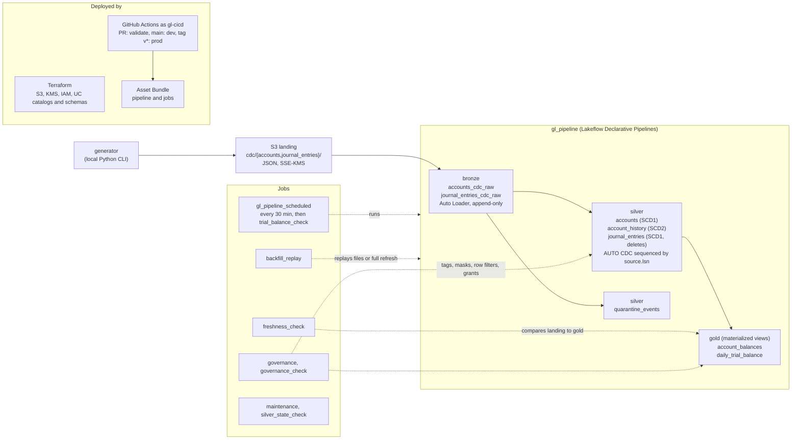

# GL CDC Lakehouse

A change data capture pipeline for general ledger data on Databricks on AWS.

Synthetic Debezium-format change events land in S3, stream through Lakeflow Declarative
Pipelines into bronze, silver and gold Delta tables, and are governed by Unity Catalog.
Terraform manages the AWS and Unity Catalog resources. Databricks Asset Bundles manage
the pipeline and jobs.

See `docs/ARCHITECTURE.md` for the design and `CLAUDE.md` for the full scope.

## Architecture



Change events land in S3 as JSON. Bronze reads them with Auto Loader and keeps every
event as it arrived, with ingest metadata. Silver drops duplicates and applies the
changes with AUTO CDC, ordered by `source.lsn`, so events that arrive late or out of
order still give the right current state and SCD2 history. Events that fail a data
quality rule go to `quarantine_events` instead of failing the pipeline. Gold computes
account balances and a daily trial balance. Unity Catalog masks the PII columns and
filters rows by business unit. Dev and prod are separate catalogs (`gl_dev`, `gl_prod`)
deployed from the same commit.

`docs/ARCHITECTURE.md` explains each decision, checkpoint by checkpoint.

## Results

Measured on dev with one simulated day of data (1.1M events), unless the row says
otherwise. Details and the commands that produced each number are in the linked file.

| Area | Result | Source |
|---|---|---|
| Idempotency | Every tuning run gave identical checksums on all 6 silver and gold tables, with 0 missing and 0 extra rows | [results.md](docs/results.md#correctness-across-every-run) |
| Replay | Replaying files whose events AUTO CDC had already applied left silver and gold unchanged | [ARCHITECTURE.md](docs/ARCHITECTURE.md#verified-on-dev-3) |
| Small files | 48 micro-batches left 23 files per bronze table, and OPTIMIZE made 1. Silver stayed at 1 file, because MERGE compacts | [results.md](docs/results.md#experiment-1-small-file-compaction) |
| Liquid clustering | A query for one account on one day read 1 of 25 files and 8% of the bytes | [results.md](docs/results.md#experiment-2-liquid-clustering-on-journal_entries) |
| Skew | The hot account holds 31% of journal lines. No fix was needed: median 1.44 s with Spark's own join choice, 1.85 s with a forced shuffle | [results.md](docs/results.md#experiment-3-the-skewed-join-on-the-hot-account) |
| Cost | A full refresh of the day costs 0.12 to 0.19 USD at list price. A small incremental update costs about 0.10 USD | [results.md](docs/results.md#cost) |
| Governance | 8 classification tags, 11 masks, 4 row filters. Verified by moving a test user through the groups | [ARCHITECTURE.md](docs/ARCHITECTURE.md#verified-by-group-membership) |
| Prod | The same commit, deployed by CI as `gl-cicd`. State, governance and trial balance checks pass | [ARCHITECTURE.md](docs/ARCHITECTURE.md#verified-on-prod) |

## Docs

- `docs/ARCHITECTURE.md`: design decisions and what was verified at each checkpoint
- `docs/RUNBOOK.md`: replay, full refresh, failed checks, deploys
- `docs/results.md`: tuning experiments and cost
- `docs/AI_USAGE.md`: what the AI assistant got wrong, and how it was caught

## Layout

```
infra/terraform/   S3, KMS, IAM, Unity Catalog resources
generator/         CDC event generator (Python CLI)
src/               pipelines, transforms, jobs
sql/governance/    tags, masks, row filters, grants
resources/         bundle resource YAML
tests/             unit and integration tests
docs/              architecture, runbook, results, AI usage
```

## Setup

Requires the AWS profile `gl-lakehouse` and the Databricks profiles `gl-dev` and `gl-prod`.

```
uv sync
uv run ruff check .
uv run pytest tests/unit
```

## Infrastructure

The `gl-lakehouse` IAM user needs permission to create the S3 bucket, the KMS key and
alias, and IAM roles named `gl-cdc-lakehouse-*`, before the first apply. Terraform cannot
grant that, because the permissions are for the identity running Terraform, so it is
attached once by hand as an account admin.

```
terraform -chdir=infra/terraform init
terraform -chdir=infra/terraform plan  -var-file=envs/dev.tfvars
terraform -chdir=infra/terraform apply -var-file=envs/dev.tfvars
```

Dev and prod share one landing bucket, one KMS key, one IAM role and one storage
credential, and therefore one state file. `envs/prod.tfvars` is a superset of
`envs/dev.tfvars`: applying it adds the prod external location, catalog and schemas
without touching dev.

### State

State is local and gitignored, which is fine for one person on one machine. On a team
it would move to an S3 backend with versioning on and a DynamoDB table for locking:

```hcl
terraform {
  backend "s3" {
    bucket         = "gl-cdc-lakehouse-tfstate"
    key            = "lakehouse/terraform.tfstate"
    region         = "us-east-2"
    dynamodb_table = "gl-cdc-lakehouse-tflock"
    encrypt        = true
  }
}
```

That gives shared state, locking so two applies cannot race, and a version history to
roll back to. The bucket and table would be bootstrapped once by hand or in a separate
config, because a backend cannot create its own storage.

## Generating events

```
uv run python -m generator --env dev --minutes 10 --rate 50
uv run python -m generator --env dev --minutes 2 --rate 20 --out-dir /tmp/gl-sample
```

`--out-dir` writes locally instead of S3. The same `--seed` always produces the same
events, which is what makes the idempotent re-run tests meaningful.
